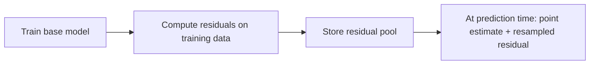
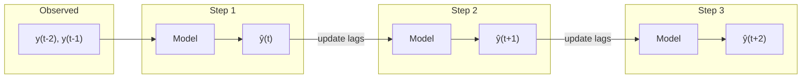
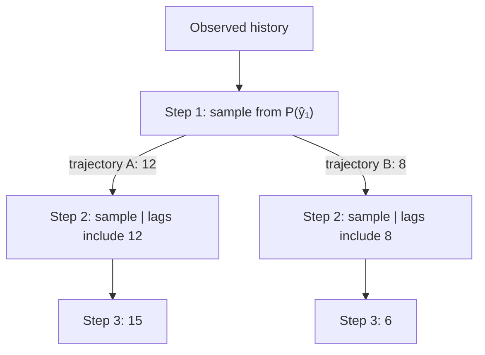
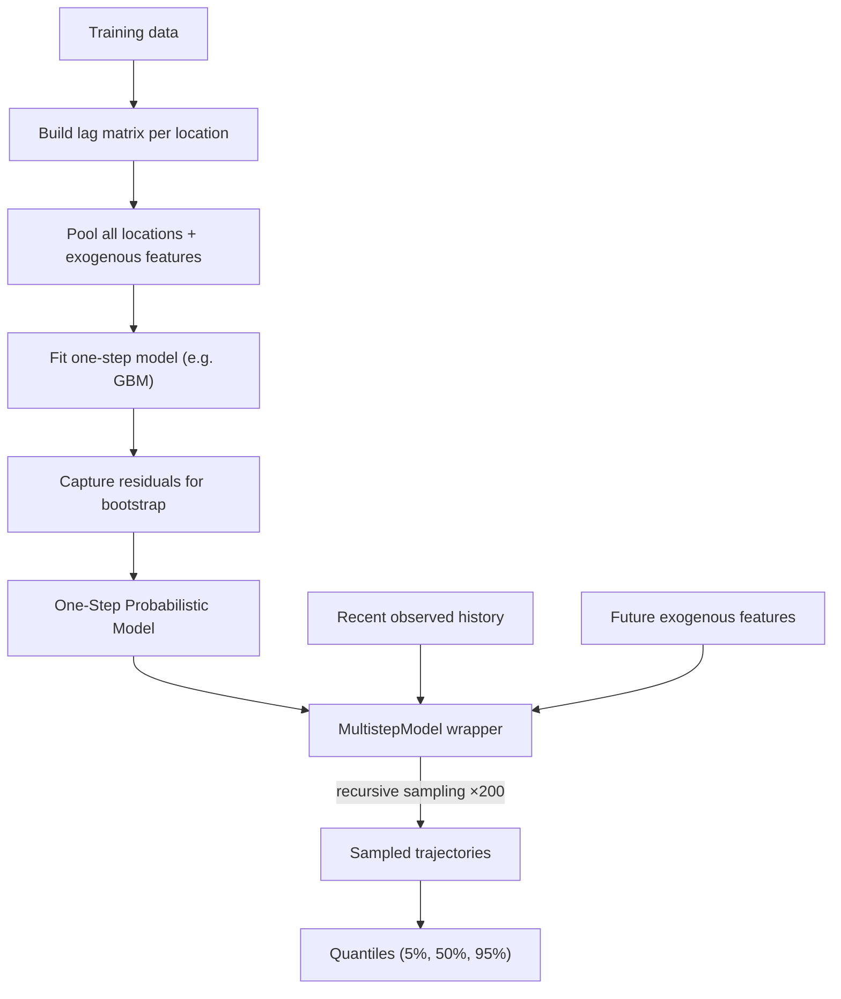
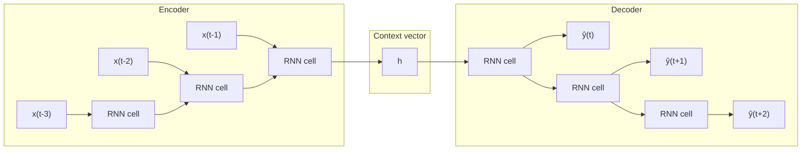
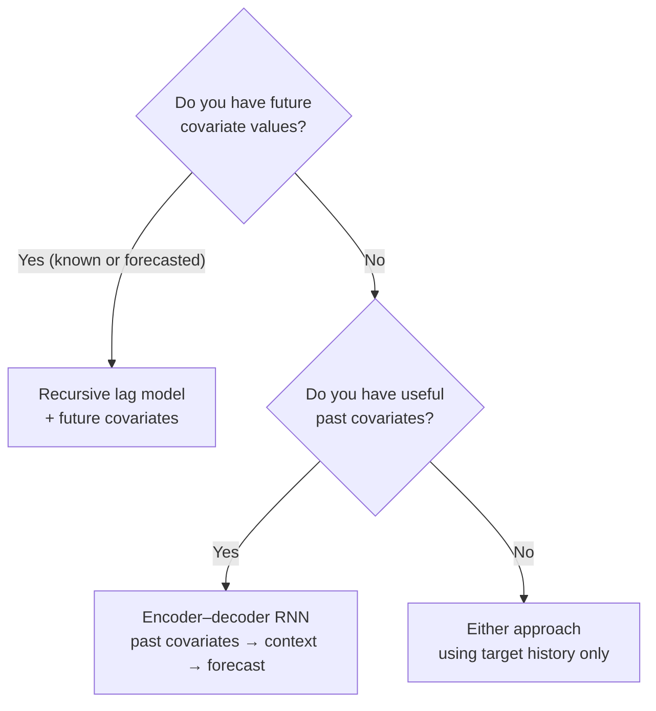

# From One-Step to Multistep Forecasting

Building probabilistic recursive forecasts for disease surveillance

---

# The Problem

We want to forecast disease cases **multiple months ahead**

- Public health decisions need **lead time** — not just next month, but 2–3+ months out
- A single point forecast isn't enough — we need **uncertainty quantification**
- Exogenous drivers (climate, population) are available for future periods

<br>

### What we need

> A model that produces **sampled forecast trajectories** across multiple future time steps, capturing growing uncertainty over the forecast horizon.

---

# The Data: Laos Dengue Surveillance

Monthly dengue cases across **18 provinces** (1998–2010)

| Feature | Description |
|---------|------------|
| `disease_cases` | Monthly case counts (target) |
| `rainfall` | Monthly precipitation |
| `mean_temperature` | Monthly average temperature |
| `mean_relative_humidity` | Monthly average humidity |
| `location` | Province code (LA-AT, LA-BK, …) |

<br>

- **Training**: 2,736 rows (18 locations × 152 months)
- **Forecast horizon**: 3 months ahead (Oct–Dec 2010)
- All locations **pooled** into a single model with location as a feature

---

# The One-Step Model

Train a regressor to predict **one step ahead** using lag features and covariates

```python
# Any sklearn regressor works as the base
base_model = GradientBoostingRegressor(n_estimators=100)

# Features: [lag_1, lag_2, ..., lag_k, rainfall, temperature, humidity, location]
# Target:   disease_cases at time t
base_model.fit(X_train, y_train)
```

<br>

The model learns: given recent history and current conditions, what happens next?

```
[cases(t-6), cases(t-5), ..., cases(t-1), rain(t), temp(t)] → cases(t)
```

This is a standard supervised regression problem.

---

# Adding Uncertainty: Residual Bootstrap

Wrap the point-prediction model to get **probabilistic** forecasts

```python
model = ResidualBootstrapModel(GradientBoostingRegressor())
model.fit(X_train, y_train)

distribution = model.predict_proba(X_new)
samples = distribution.sample(200)  # (200, n_points)
```

<br>

### How it works



Each sample = `ŷ + ε` where `ε` is drawn from the empirical residual distribution.

No distributional assumptions needed — the data tells us about uncertainty.

---

# The Lag Matrix

Transform a time series into supervised learning features

Given series `y = [10, 20, 30, 40, 50, 60]` with `n_lags = 3`:

| lag₁ (t-3) | lag₂ (t-2) | lag₃ (t-1) | target |
|:-----------:|:-----------:|:-----------:|:------:|
| 10 | 20 | 30 | **40** |
| 20 | 30 | 40 | **50** |
| 30 | 40 | 50 | **60** |

<br>

```python
def _build_lag_matrix(y, n_lags):
    """Slide a window over the series — oldest to newest."""
    # Returns shape (n_timepoints - n_lags, n_lags)
```

- Each row is one training example: the recent window → next value
- For multi-location data, lags are built **per location**, then stacked
- Exogenous features are appended alongside the lag columns

---

# Recursive Forecasting

Feed predictions back as inputs to forecast multiple steps



At each step:
1. Build feature vector from current lag window + exogenous features
2. **Sample** from the one-step distribution (not just point predict)
3. Shift the lag window: drop oldest, append the sampled value
4. Repeat for the next step

The same trained one-step model is reused at every step.

---

# Sampling Trajectories

Each sampled path through the recursive loop gives one **plausible future**



- Draw **200+ trajectories** to map out the forecast distribution
- Uncertainty **grows** with each step — early samples affect later predictions
- Compute quantiles across trajectories for prediction intervals

<br>

> The fan of trajectories naturally captures how confidence degrades over the forecast horizon.

---

# The Complete Pipeline



<br>

```python
one_step = ResidualBootstrapModel(GradientBoostingRegressor())
model = MultistepModel(one_step, n_target_lags=6)
model.fit(y_train, X_train)

distribution = model.predict_proba(recent_y, n_steps=3, X=future_X)
trajectories = distribution.sample(200)  # (200, 3)
```

---
layout: center
---

# Results: Forecast Fan

For each location, 200 sampled trajectories produce a **prediction fan**:

```
Cases
  │
  │    ╱ · · ·  ·  95th percentile
  │   ╱ · · ·
  │  ╱ ─ ─ ─ ─    median
  │ ╱ · · ·
  │╱ · · ·  ·     5th percentile
  │
  ├──────┬──────┬──────
  t      t+1    t+2    t+3
       Forecast horizon →
```

- **Narrow near, wide far** — uncertainty grows with horizon
- Each trajectory is a coherent path, not independent draws
- Negative samples are clamped to 0 (case counts can't be negative)

Output: one row per location per step, with `sample_0 … sample_199` columns

---

# A Limitation: What If We Don't Know Future Covariates?

Our recursive approach requires **future exogenous features** at each forecast step

```
Step 1: lags + rain(t)   + temp(t)   → ŷ(t)
Step 2: lags + rain(t+1) + temp(t+1) → ŷ(t+1)   ← we need these!
Step 3: lags + rain(t+2) + temp(t+2) → ŷ(t+2)   ← and these!
```

<br>

This is fine when future covariates are **known** (e.g. climate forecasts, calendar features).

But often we **don't** have future covariates — only **past** covariates are available.

> How can we still leverage covariate information for multistep forecasting?

---

# Past vs Future Covariates

Two fundamentally different types of exogenous information

| | Past covariates | Future covariates |
|---|---|---|
| **Available at** | Only up to time *t* | Known for *t+1, t+2, …* |
| **Examples** | Lab results, observed rainfall, reported cases in neighboring regions | Calendar (month, holidays), scheduled interventions, climate forecasts |
| **Challenge** | Can't feed into future decoder steps | Must be accurate forecasts themselves |

<br>

**Key insight**: Past covariates contain useful context (e.g. "there was heavy rain last month") even though we can't observe them in the future.

We need an architecture that can **summarize past context** and use it to **drive future predictions** without requiring covariate values at future time steps.

---

# The Encoder–Decoder Pattern

Separate the model into two stages with distinct roles



- **Encoder**: Reads the full historical window (target + all covariates) and compresses it into a **context vector** *h*
- **Decoder**: Unrolls *h* into future predictions — no covariates needed at future steps

---

# The Encoder: Compressing History

The encoder RNN processes the observed window step by step

```python
# Encoder input at each past time step:
# [cases(t), rainfall(t), temperature(t), humidity(t)]

for t in range(lookback):
    h = encoder_rnn(x_past[t], h)  # update hidden state

# h now summarizes the entire observed history
```

<br>

At each time step the RNN sees **both** the target and all covariates.

The final hidden state *h* captures:
- Recent trend and level of disease cases
- Seasonal patterns in the covariate history
- Cross-variable relationships (e.g. rain spike → case spike 2 months later)

> All the covariate information is **baked into** the context vector — we don't need covariates again.

---

# The Decoder: Generating the Forecast

The decoder autoregressively produces future steps from the context

```python
# Decoder receives only the context vector — no future covariates
h_dec = h  # initialize from encoder

for step in range(n_forecast_steps):
    output, h_dec = decoder_rnn(prev_output, h_dec)
    y_hat[step] = linear(output)
    prev_output = y_hat[step]  # autoregressive: feed prediction back
```

<br>

### Why this works

- The **hidden state** carries forward everything the model learned from the past
- Each decoder step updates the hidden state — the model tracks its own evolving "belief"
- Future covariates are not needed because their effects are already encoded

The decoder is essentially doing **recursive forecasting inside the network** — same idea as our explicit lag-based recursion, but learned end-to-end.

---

# Encoder–Decoder vs Recursive Lag Model

Comparing the two multistep approaches

| | Recursive lag model | Encoder–decoder RNN |
|---|---|---|
| **Past covariates** | Used if available as features | Consumed by encoder |
| **Future covariates** | **Required** at each step | **Not needed** |
| **How context is carried** | Explicit lag window | Learned hidden state |
| **Uncertainty** | Bootstrap residuals | Parametric output layer or dropout sampling |
| **Training** | Two-stage (fit regressor, then recurse) | End-to-end (encoder + decoder jointly) |
| **Error propagation** | Errors compound through explicit recursion | Errors compound through hidden state |

<br>

> The encoder–decoder doesn't eliminate error accumulation — it just moves the recursion **inside** the neural network, where it can be optimized end-to-end.

---

# Probabilistic Decoder Outputs

Adding uncertainty to the encoder–decoder

Instead of predicting a point value, the decoder outputs **distribution parameters**:

```python
# At each decoder step, output parameters of a distribution
output, h_dec = decoder_rnn(prev_output, h_dec)

mu = linear_mu(output)        # predicted mean
sigma = softplus(linear_sigma(output))  # predicted std (positive)

# Sample for the next autoregressive step
y_hat = Normal(mu, sigma).sample()
```

<br>

Alternatives for probabilistic outputs:
- **Gaussian**: Output `(mu, sigma)` — simple, works for continuous targets
- **Negative binomial**: Output `(mu, alpha)` — better for count data (disease cases)
- **Quantile regression**: Output quantiles directly — no distributional assumption
- **MC Dropout**: Keep dropout at inference, sample multiple forward passes

---

# When to Use Which Approach

Choose based on what information is available at forecast time



<br>

- **Recursive lag model**: Simpler, interpretable, works great with tree-based models. Use when future covariates are available.
- **Encoder–decoder**: More complex, but handles the past-only covariate case naturally. Use when you have rich history but no future information.
- **Hybrid**: Some frameworks (e.g. TFT, DeepAR) combine both — encoder for past covariates, decoder accepts known future covariates too.

