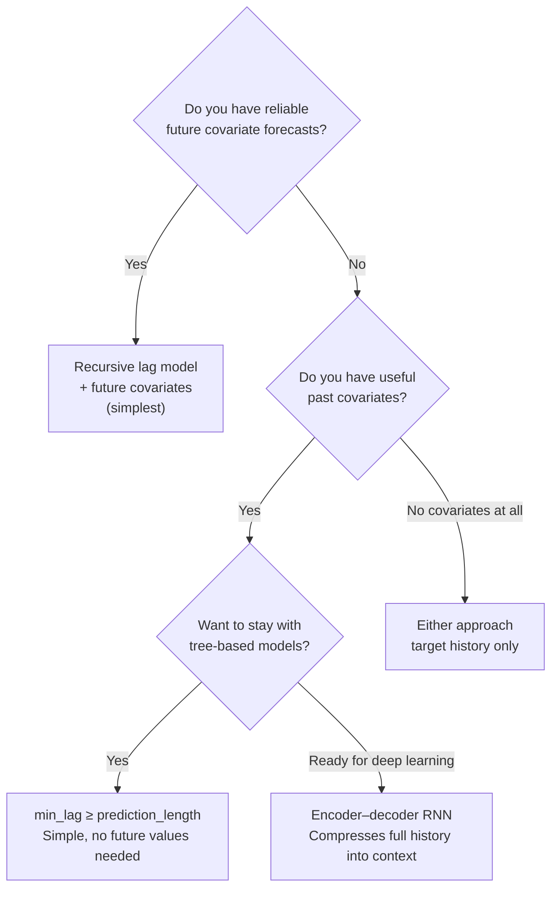

# From One-Step to Multistep Forecasting

Building probabilistic recursive forecasts for disease surveillance

---

# Starting Point: You Know Regression

You're comfortable with sklearn, GLMs, gradient boosting — **supervised learning**.

But now you need to forecast a **time series** across **many locations**.

<br>

### The gap

| You know how to… | But time series needs… |
|---|---|
| Fit `X → y` on tabular data | Features built from the target's own **history** |
| Predict once | Predict **multiple steps** into the future |
| Get a point estimate | **Uncertainty** that grows with forecast horizon |
| Train one model per dataset | One model that works across **18+ locations** |

<br>

> This talk shows how to bridge that gap — turning a standard regressor into a full multistep probabilistic forecasting system, step by step.

---

# The Problem

We want to forecast disease cases **multiple months ahead**

- Public health decisions need **lead time** — not just next month, but 2–3+ months out
- A single point forecast isn't enough — we need **uncertainty quantification**
- Exogenous drivers (climate, population) are available for future periods

<br>

### What we need

> A model that produces **sampled forecast trajectories** across multiple future time steps, capturing growing uncertainty over the forecast horizon.

---

# The Data: Laos Dengue Surveillance

Monthly dengue cases across **18 provinces** (1998–2010)

| Feature | Description |
|---------|------------|
| `disease_cases` | Monthly case counts (target) |
| `rainfall` | Monthly precipitation |
| `mean_temperature` | Monthly average temperature |
| `mean_relative_humidity` | Monthly average humidity |
| `location` | Province code (LA-AT, LA-BK, …) |

<br>

- **Training**: 2,736 rows (18 locations × 152 months)
- **Forecast horizon**: 3 months ahead (Oct–Dec 2010)
- All locations **pooled** into a single model with location as a feature

---

# The One-Step Model

Train a regressor to predict **one step ahead** using lag features and covariates

```python
# Any sklearn regressor works as the base
base_model = GradientBoostingRegressor(n_estimators=100)

# Features: [lag_1, lag_2, ..., lag_k, rainfall, temperature, humidity, location]
# Target:   disease_cases at time t
base_model.fit(X_train, y_train)
```

<br>

The model learns: given recent history and current conditions, what happens next?

```
[cases(t-6), cases(t-5), ..., cases(t-1), rain(t), temp(t)] → cases(t)
```

This is a standard supervised regression problem.

---

# Adding Uncertainty: Residual Bootstrap

Wrap the point-prediction model to get **probabilistic** forecasts

```python
model = ResidualBootstrapModel(GradientBoostingRegressor())
model.fit(X_train, y_train)

distribution = model.predict_proba(X_new)
samples = distribution.sample(200)  # (200, n_points)
```

<br>

### How it works


Each sample = `ŷ + ε` where `ε` is drawn from the empirical residual distribution.

No distributional assumptions needed — the data tells us about uncertainty.

---

# The Lagging Transformation

Raw data is **time-aligned** — each row has values observed at the same time:

**Before: X, y aligned by time** (single location shown)

| time | rainfall | temp | humidity | disease_cases |
|------|:--------:|:----:|:--------:|:-------------:|
| Jan  | 120      | 28   | 80       | 15            |
| Feb  | 95       | 29   | 75       | 22            |
| Mar  | 60       | 31   | 65       | 30            |
| Apr  | 40       | 32   | 60       | 40            |
| May  | 30       | 30   | 70       | 50            |

We can't use this directly — the model would see **current** covariates, not lagged causes.

---

# After the Lagging Transformation

Original columns are **replaced** by their lags; target lags are added as features.

`lag_all_features(df, min_lag=1, max_lag=2)` + `add_lagged_targets(..., min_lag=1, max_lag=2)`:

**After: X lagged, y unchanged** (original columns dropped)

| time | rain_lag1 | rain_lag2 | temp_lag1 | temp_lag2 | hum_lag1 | hum_lag2 | target_lag1 | target_lag2 | **y** |
|------|:---------:|:---------:|:---------:|:---------:|:--------:|:--------:|:-----------:|:-----------:|:-----:|
| Mar  | 95        | 120       | 29        | 28        | 75       | 80       | 22          | 15          | **30** |
| Apr  | 60        | 95        | 31        | 29        | 65       | 75       | 30          | 22          | **40** |
| May  | 40        | 60        | 32        | 31        | 60       | 65       | 40          | 30          | **50** |

- Original `rainfall`, `temp`, `humidity` columns are **gone** — replaced by `_lag1`, `_lag2`
- `target_lag1`, `target_lag2` added from `disease_cases` history
- First rows lost (need history to fill lags) — **no leakage**

---

# The min_lag Trick: Avoiding Future Covariates Entirely

If `min_lag >= prediction_length`, all covariate lags are **already observed** at forecast time

Example: forecasting **3 steps** ahead with `min_lag=3`:

```
Forecasting from time t → predicting t+1, t+2, t+3

rain_lag3 at step t+1  =  rain(t-2)  ✅ observed
rain_lag3 at step t+2  =  rain(t-1)  ✅ observed
rain_lag3 at step t+3  =  rain(t)    ✅ observed  ← the "newest" value used
```

The furthest future step only reaches back to time *t* — which we already have.

<br>

With `min_lag=1` we'd need `rain(t+2)` for step 3 — a **future** value we don't have.

> **Rule**: Set `min_lag >= prediction_length` and you never need future covariates. Trade-off: you lose the most recent lag information, but gain a model that works without any forecasted inputs.

---

# Recursive Forecasting

Feed predictions back as inputs to forecast multiple steps


At each step:
1. Build feature vector from current lag window + exogenous features
2. **Sample** from the one-step distribution (not just point predict)
3. Shift the lag window: drop oldest, append the sampled value
4. Repeat for the next step

The same trained one-step model is reused at every step.

---

# Sampling Trajectories

Each sampled path through the recursive loop gives one **plausible future**


- Draw **200+ trajectories** to map out the forecast distribution
- Uncertainty **grows** with each step — early samples affect later predictions
- Compute quantiles across trajectories for prediction intervals

<br>

> The fan of trajectories naturally captures how confidence degrades over the forecast horizon.

---

# The Complete Pipeline


<br>

```python
one_step = ResidualBootstrapModel(GradientBoostingRegressor())
model = MultistepModel(one_step, n_target_lags=6)
model.fit(y_train, X_train)

distribution = model.predict_proba(recent_y, n_steps=3, X=future_X)
trajectories = distribution.sample(200)  # (200, 3)
```

---
layout: center
---

# Results: Forecast Fan

For each location, 200 sampled trajectories produce a **prediction fan**:

```
Cases
  │
  │    ╱ · · ·  ·  95th percentile
  │   ╱ · · ·
  │  ╱ ─ ─ ─ ─    median
  │ ╱ · · ·
  │╱ · · ·  ·     5th percentile
  │
  ├──────┬──────┬──────
  t      t+1    t+2    t+3
       Forecast horizon →
```

- **Narrow near, wide far** — uncertainty grows with horizon
- Each trajectory is a coherent path, not independent draws
- Negative samples are clamped to 0 (case counts can't be negative)

Output: one row per location per step, with `sample_0 … sample_199` columns

---

# A Limitation: We Don't Have Reliable Climate Forecasts

Our recursive approach requires **future exogenous features** at each forecast step

```
Step 1: lags + rain(t)   + temp(t)   → ŷ(t)
Step 2: lags + rain(t+1) + temp(t+1) → ŷ(t+1)   ← we need these!
Step 3: lags + rain(t+2) + temp(t+2) → ŷ(t+2)   ← and these!
```

<br>

**Our problem**: Reliable forecasted climate variables (rainfall, temperature, humidity) are **not available** for the Laos provinces at the lead times we need.

- Climate forecasts at sub-national level are inaccurate or unavailable
- Using bad climate forecasts as inputs can be **worse than not using them at all**
- But past climate clearly matters — rain *last month* drives cases *this month*

Two solutions:
1. **Simple**: Set `min_lag >= prediction_length` so all covariate lags stay in the past (we already covered this!)
2. **Deep learning**: Use an encoder–decoder architecture to compress history into a context vector

---

# Past vs Future Covariates

Two fundamentally different types of exogenous information

| | Past covariates | Future covariates |
|---|---|---|
| **Available at** | Only up to time *t* | Known for *t+1, t+2, …* |
| **Our data** | Observed rainfall, temperature, humidity up to now | Would need forecasted climate — **not reliably available** |
| **Challenge** | Can't feed into future decoder steps | Inaccurate forecasts add noise, not signal |

<br>

**Our situation**: We have rich climate history that clearly drives dengue dynamics, but we can't get reliable climate forecasts for Laos provinces.

**Key insight**: Past climate contains useful context (e.g. "heavy rain last month → expect case surge") even though we can't observe future climate.

We need an architecture that can **summarize past climate context** and use it to **drive future predictions** without requiring climate values at future time steps.

---

# The Encoder–Decoder Pattern

Separate the model into two stages with distinct roles


- **Encoder**: Reads the full historical window (target + all covariates) and compresses it into a **context vector** *h*
- **Decoder**: Unrolls *h* into future predictions — no covariates needed at future steps

---

# The Encoder: Compressing History

The encoder RNN processes the observed window step by step

```python
# Encoder input at each past time step:
# [cases(t), rainfall(t), temperature(t), humidity(t)]

for t in range(lookback):
    h = encoder_rnn(x_past[t], h)  # update hidden state

# h now summarizes the entire observed history
```

<br>

At each time step the RNN sees **both** the target and all climate covariates.

The final hidden state *h* captures:
- Recent trend and level of disease cases
- Seasonal climate patterns (monsoon cycles, temperature trends)
- Cross-variable relationships (e.g. rain spike → case surge 2 months later)

> All the climate information is **baked into** the context vector — we don't need future climate values.

---

# The Decoder: Generating the Forecast

The decoder autoregressively produces future steps from the context

```python
# Decoder receives only the context vector — no future covariates
h_dec = h  # initialize from encoder

for step in range(n_forecast_steps):
    output, h_dec = decoder_rnn(prev_output, h_dec)
    y_hat[step] = linear(output)
    prev_output = y_hat[step]  # autoregressive: feed prediction back
```

<br>

### Why this works

- The **hidden state** carries forward everything the model learned from the past
- Each decoder step updates the hidden state — the model tracks its own evolving "belief"
- Future covariates are not needed because their effects are already encoded

The decoder is essentially doing **recursive forecasting inside the network** — same idea as our explicit lag-based recursion, but learned end-to-end.

---

# Encoder–Decoder vs Recursive Lag Model

Comparing the two multistep approaches

| | Recursive lag model | Encoder–decoder RNN |
|---|---|---|
| **Climate covariates** | Needed at **every future step** | Only needed in the **past** |
| **Without climate forecasts** | Must drop covariates entirely | Still uses full climate history |
| **How context is carried** | Explicit lag window | Learned hidden state |
| **Uncertainty** | Bootstrap residuals | Parametric output layer or dropout sampling |
| **Training** | Two-stage (fit regressor, then recurse) | End-to-end (encoder + decoder jointly) |
| **Error propagation** | Errors compound through explicit recursion | Errors compound through hidden state |

<br>

> For our Laos dengue case: the encoder–decoder lets us **use climate history without needing climate forecasts** — the key advantage when reliable forecasted climate data isn't available.

---

# Probabilistic Decoder Outputs

Adding uncertainty to the encoder–decoder

Instead of predicting a point value, the decoder outputs **distribution parameters**:

```python
# At each decoder step, output parameters of a distribution
output, h_dec = decoder_rnn(prev_output, h_dec)

mu = linear_mu(output)        # predicted mean
sigma = softplus(linear_sigma(output))  # predicted std (positive)

# Sample for the next autoregressive step
y_hat = Normal(mu, sigma).sample()
```

<br>

Alternatives for probabilistic outputs:
- **Gaussian**: Output `(mu, sigma)` — simple, works for continuous targets
- **Negative binomial**: Output `(mu, alpha)` — better for count data (disease cases)
- **Quantile regression**: Output quantiles directly — no distributional assumption
- **MC Dropout**: Keep dropout at inference, sample multiple forward passes

---

# When to Use Which Approach

Choose based on what covariate information is available at forecast time



<br>

- **`min_lag >= prediction_length`**: Simplest fix — stays within our existing pipeline, just loses the most recent covariate lags
- **Encoder–decoder**: More powerful — uses *all* history including recent lags, but requires a neural network
- **Hybrid** (TFT, DeepAR): Best of both — encoder for past covariates, decoder also accepts known future covariates (e.g. month-of-year)

